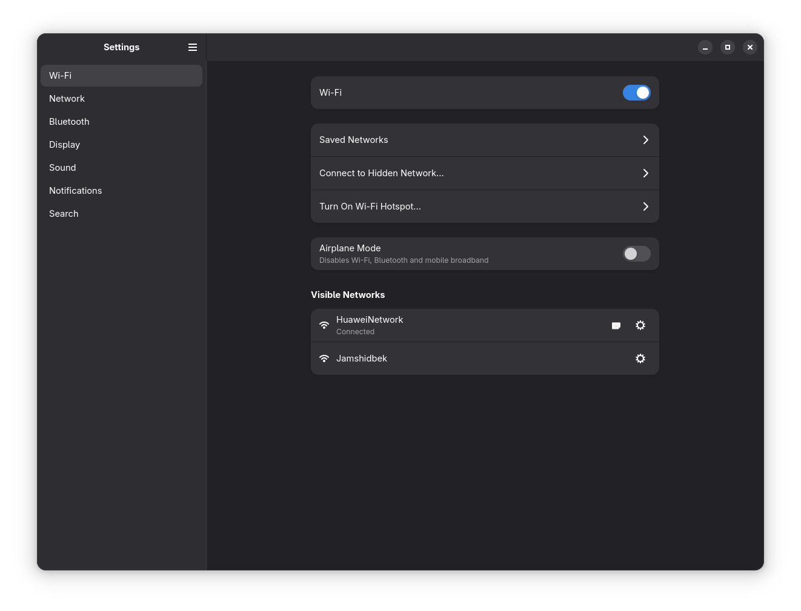

<p align="center">
    <h3 align="center">GNOME Settings Application written on Rust/GTK.</h3>
</p>

<p align="center">
    
</p>

<p align="center">
    
    <a href="https://github.com/xinux-org/e-imzo/actions/workflows/test.yml"></a>
</p>

## About

Rewritten version of GNOME Control Center for Xinux OS.

## Development

This application has Linux-only dependencies.

```bash
# download dependencies
nix develop 

# Initiate meson environment for the first time. This will generate ./src/config.rs
meson setup build

# build the project
nix build . --show--trace

./result/bin/control-center

# Optional. Generate translation words from /po/POTFILES.in if needed.
cd ./po
xgettext --directory=.. --files-from=POTFILES.in --from-code=UTF-8 -kgettext -o translations.pot
```
